# Sync an EarthRanger event type to CMORE

This tutorial walks you through connecting EarthRanger to CMORE so that when a
ranger reports an event in EarthRanger, it appears in CMORE — on the map, in
the message feed, and classified with a CMORE tag — within minutes, with no
re-typing.

We use one concrete example the whole way: the **Rhino Carcass** event type.
By the end you will have reported a rhino carcass in EarthRanger and watched
it arrive in CMORE looking like this:

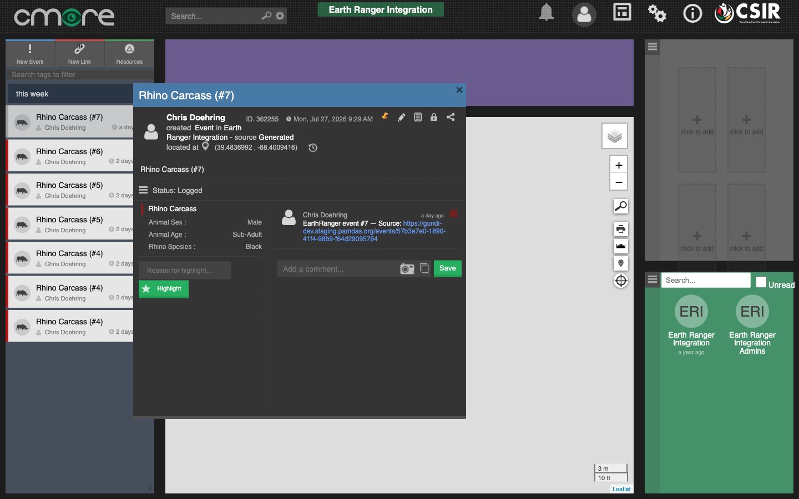

Everything in this guide is point-and-click in three web portals. You do not
need to write code or call APIs.

[← Overview](index.md)

---

## What you're building

Three systems cooperate, and each is configured in its own portal:

```
EarthRanger  ──►  Gundi  ──►  CMORE
(rangers          (routes and     (your partners see the
 report events)    translates)     event, tagged, on their map)
```

- **EarthRanger** is where events are reported.
- **Gundi** (gundiservice.org) is the data-sharing platform that polls
  EarthRanger for new events, translates them into CMORE's format, and
  delivers them.
- **CMORE** is where the events land, in your organisation's **share group**,
  classified with a CMORE **tag**.

You configure each piece once. After that the pipeline runs by itself.

## Prerequisites

You need working logins for all three systems:

| System | You need | Example used here |
|---|---|---|
| EarthRanger | A site login that can report events | `gundi-dev.staging.pamdas.org` |
| Gundi portal | An account in your organisation | `gundiservice.org` |
| CMORE | A user in your organisation's share group | `cmorewc1.chpc.ac.za` |

> **Ask your CMORE administrator (CSIR) for these — they are not self-service:**
>
> 1. **An organisation (share group) on the CMORE instance**, with your CMORE
>    user in it. Organisations and share groups are created by the CMORE team.
> 2. **Access to the tag domain you need.** Tags live in *tag domains* (for
>    example, the **Wildlife** domain contains Rhino Carcass, Poacher
>    Sighting, Wounded Rhino and 14 more). Your share group can only use tags
>    from domains it has been granted. Domains you don't have simply don't
>    appear anywhere in your screens, and some — including Wildlife, which is
>    marked as Stop Rhino Poaching intellectual property — are restricted and
>    granted case-by-case. Tell the CMORE team **which tags you want to use
>    and which share group needs them**.
>
> Everything else in this guide — creating the service, getting the API key,
> finding your share group ID, mapping fields — you can do yourself.

## Part 1: Set up the CMORE side

In this part you create a **service** in CMORE (an identity for the
integration), get its **API token**, and note your **share group ID**. You'll
paste these three things into Gundi in Part 2.

CMORE has two web interfaces, and this part uses both:

- the **Web Portal** (the map view you normally use), and
- the **Cmore Admin Site**, opened from the portal via the **gears icon** in
  the top-right toolbar (hover text "Manage Users"). It opens in a new tab.

### 1.1 Open the Cmore Admin Site

1. Sign in to the CMORE Web Portal.

   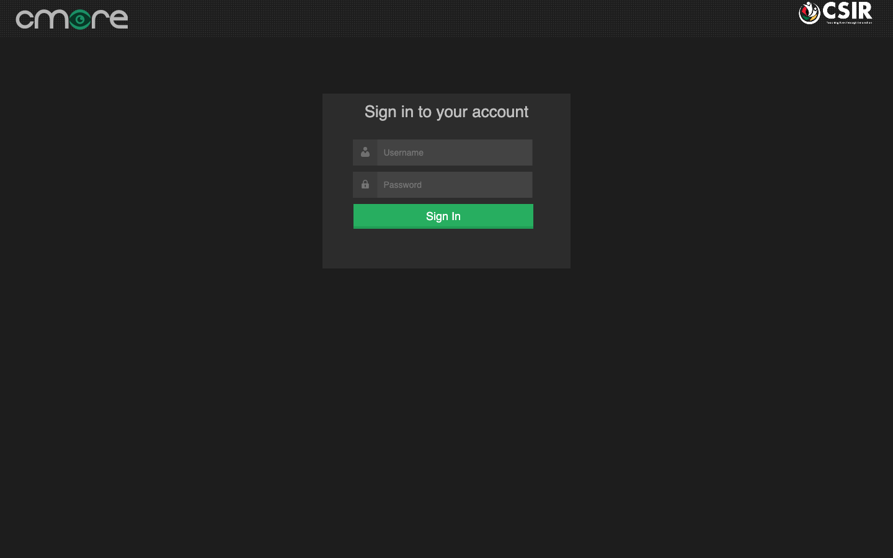

2. Click the **gears icon** in the top-right toolbar. A new tab opens with
   the **Cmore Admin Site**. The left menu has **Manage Users**, **Manage Tag
   Shortcuts**, **Manage Tags**, **Service**, and **Log**.

   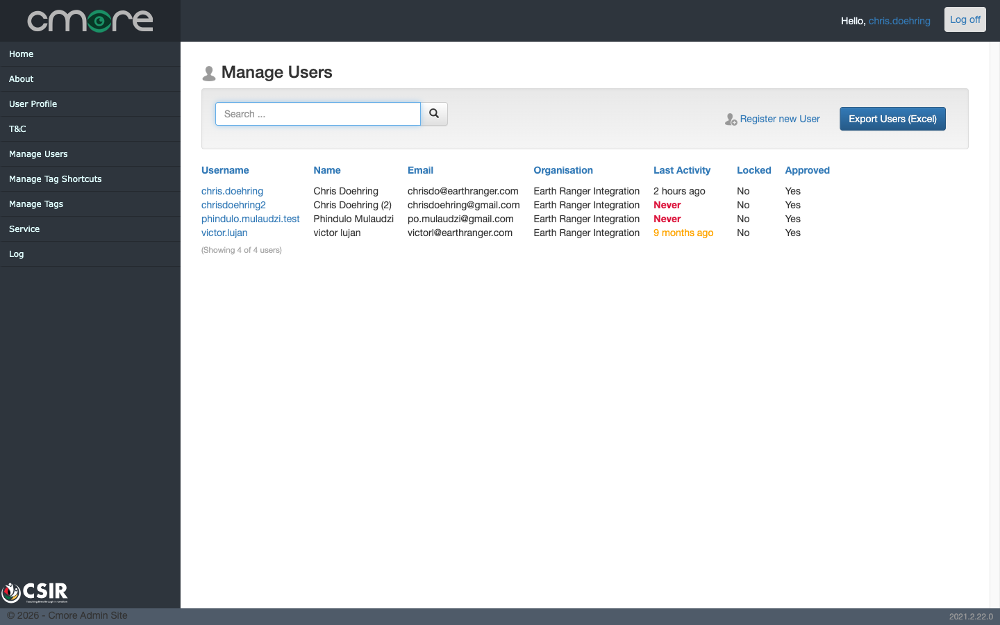

### 1.2 Create the service and get its API token

1. In the left menu, click **Service**. You'll see the **External Services**
   list — every integration identity your organisation has.

   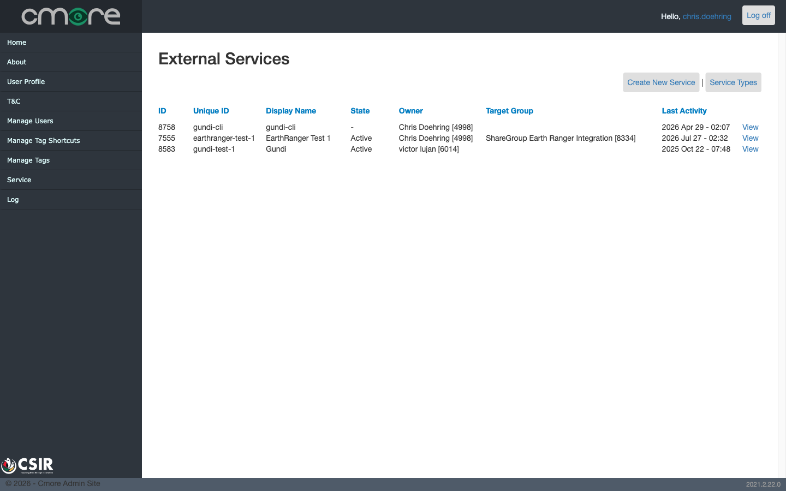

2. Click **Create New Service**. Enter a **Unique Id** (short, no spaces —
   e.g. `earthranger-prod`) and a **Display Name** (e.g. `EarthRanger`), then
   click **Create**.

   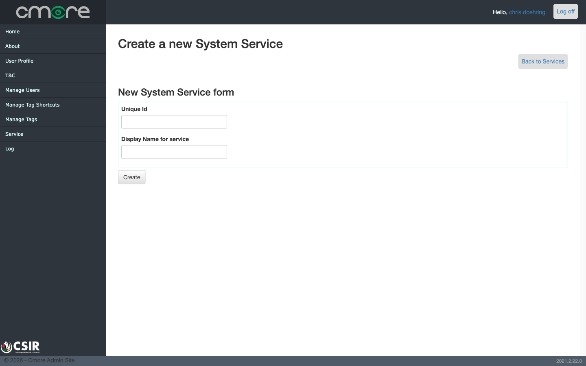

3. Back in the list, click **View** on your new service. The service page
   shows an **API Key** section with the **Auth Token** — this is the token
   Gundi will use. Copy it somewhere safe.

   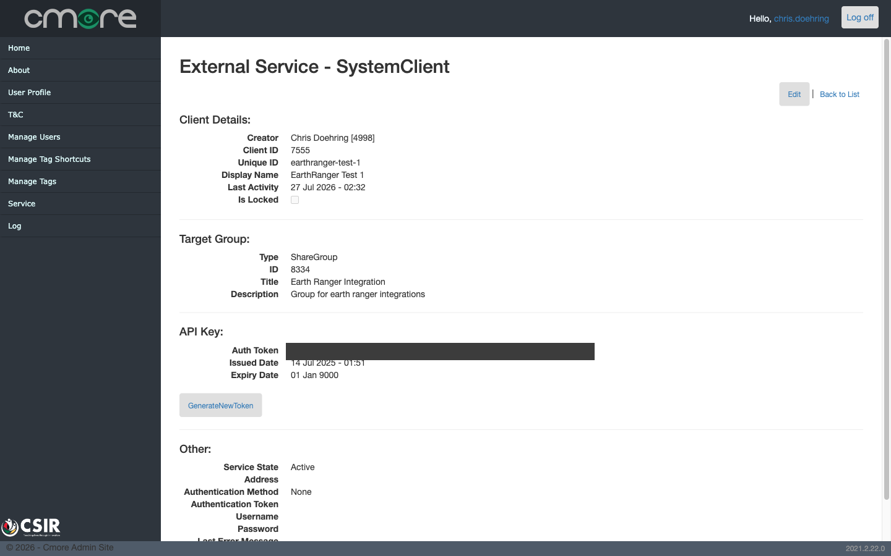

   > If the token is ever exposed, come back here and click
   > **GenerateNewToken** — it invalidates the old token immediately.
   > Remember to paste the new one into Gundi (Part 2.2).

### 1.3 Link the service to your share group

The token only works when the service points at your share group.

1. On the service page click **Edit**.
2. Set **Target Group ID** to your share group's numeric ID and set
   **State** to **Active**, then **Save**.

   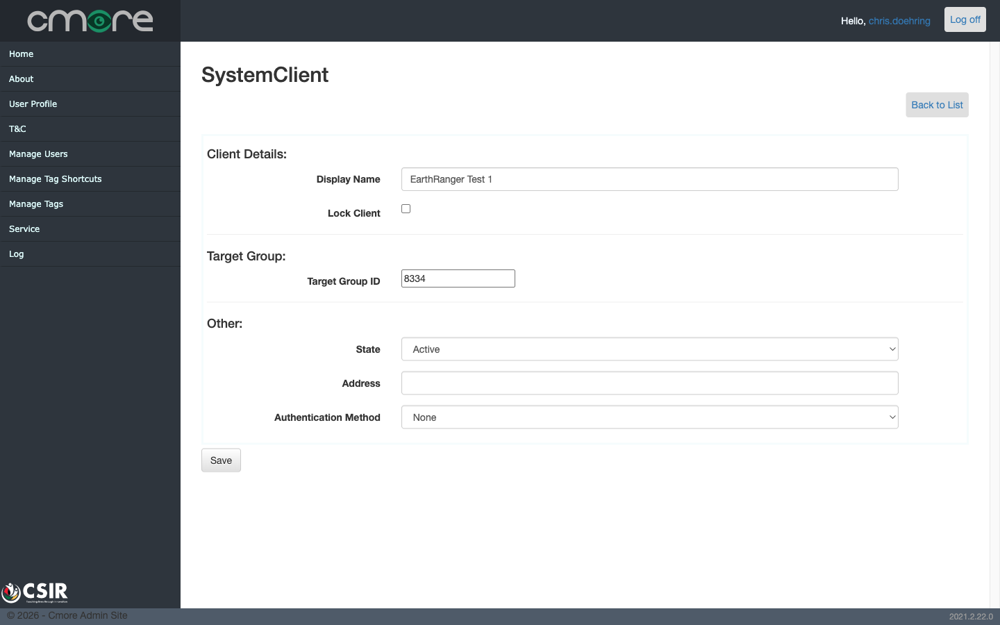

   **Where do I find my share group ID?** If your organisation already has a
   working service, its **Target Group** section shows it (e.g. `ShareGroup —
   ID 8334 — Earth Ranger Integration`). If not, ask the CMORE team for your
   share group's ID when they create it — the web portal shows your group's
   *name* (top toolbar and profile) but not its number.

3. Note down the **Target Group ID** — Gundi calls it the **Owner Group ID**
   and you'll enter it again in Part 2.2.

### 1.4 Confirm you can see the tags you need

1. Still in the Admin Site, click **Manage Tags**. Domains granted to your
   organisation are listed — here, **Wildlife** with its 17 tags.

   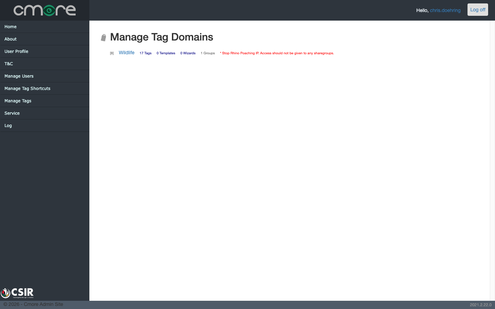

2. Click the domain name to see its tags and which share groups are assigned.
   Confirm your share group appears under **Assigned ShareGroups**.

   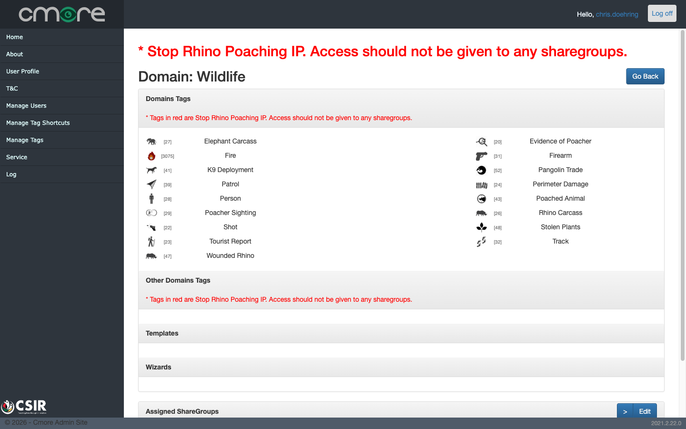

3. Cross-check in the Web Portal: click **New Event** on the messages tile.
   The "Choose a tag" screen must show the tags your events will use (e.g.
   **Rhino Carcass** under **Wildlife**). If a tag is missing here, it will
   be silently dropped from delivered events — go back to the prerequisites
   box and contact the CMORE team.

   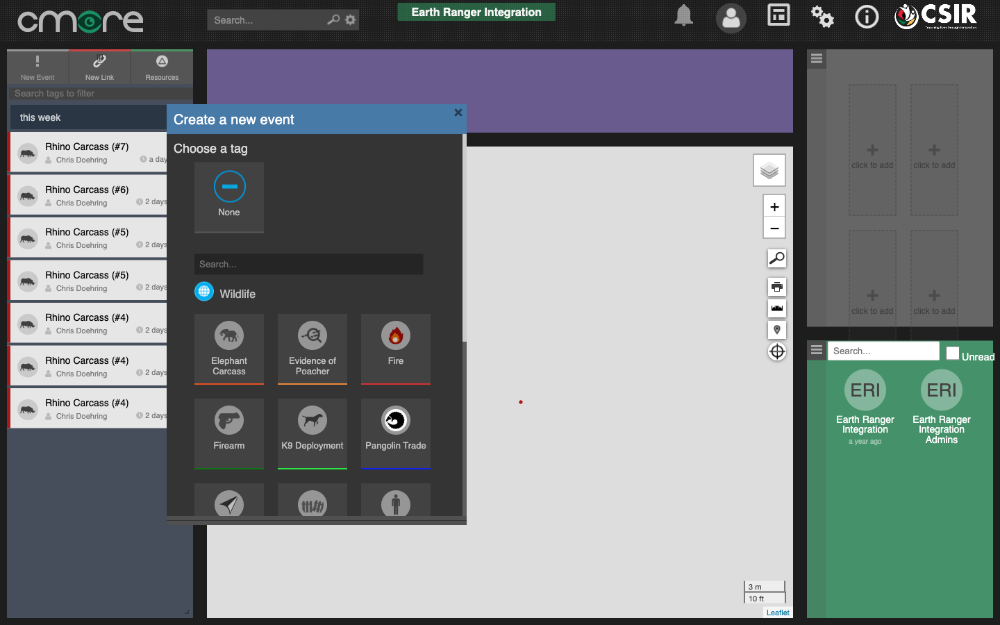

You now have the three values Part 2 needs: the **API token**, the **API base
URL** (your CMORE server + `/za/WebAPI/api`, e.g.
`https://cmorewc1.chpc.ac.za/za/WebAPI/api`), and the **Owner Group ID**.

## Part 2: Configure the Gundi destination

In this part you point Gundi at CMORE: enter the credentials, test them, and
tell Gundi how to translate the Rhino Carcass event type into the CMORE
Rhino Carcass tag.

### 2.1 Open your connection's CMORE destination

1. Sign in to the Gundi portal and open **Connections**, then your
   connection. A connection links a *source* (your EarthRanger site) to one
   or more *destinations* (CMORE). Its page has five tabs: **General**,
   **Provider**, **Destinations**, **Sources**, and **Logs**. Open the
   **Destinations** tab — your CMORE destination is listed there.

   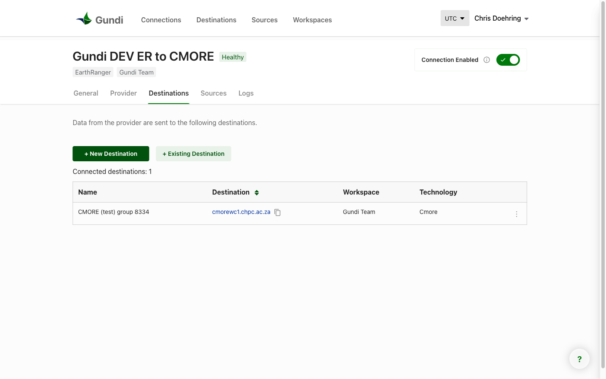

2. Click the CMORE destination to open its **Configuration** tab. It has the
   destination's name and URL at the top, then an **Auth** section and a
   **Deliver** section.

   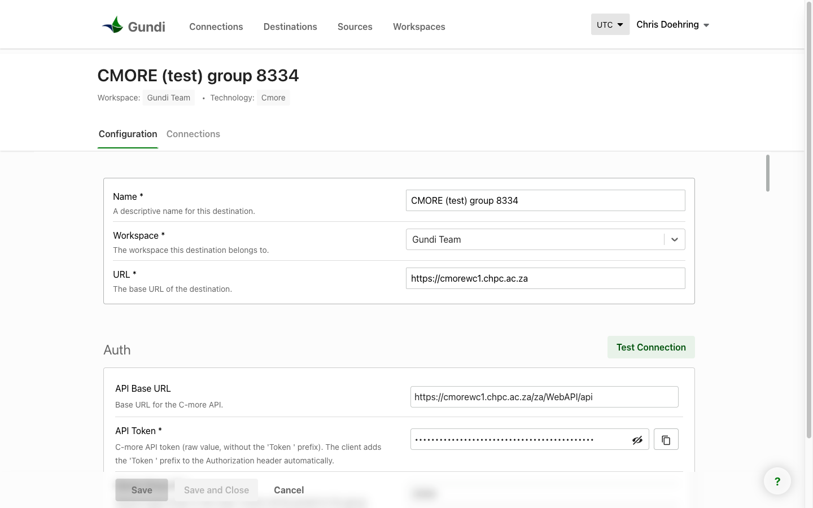

### 2.2 Fill in Auth and test it

1. In the **Auth** section, enter the three values from Part 1:

   | Field | Value |
   |---|---|
   | **API Base URL** | e.g. `https://cmorewc1.chpc.ac.za/za/WebAPI/api` — note it ends with `/za/WebAPI/api`, not just the host |
   | **API Token** | the service's Auth Token (paste the raw value — the field shows it masked) |
   | **Owner Group ID** | your share group's numeric ID (the service's Target Group ID, e.g. `8334`) |

   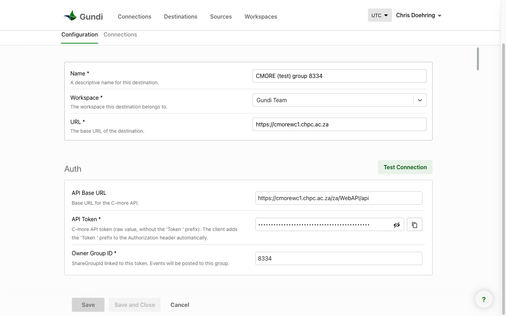

2. Save, then click **Test Connection** (top right of the Auth section).
   This checks the token against your CMORE server before any data flows —
   it catches a bad token or wrong URL immediately. You want the green
   **Valid Credentials** result:

   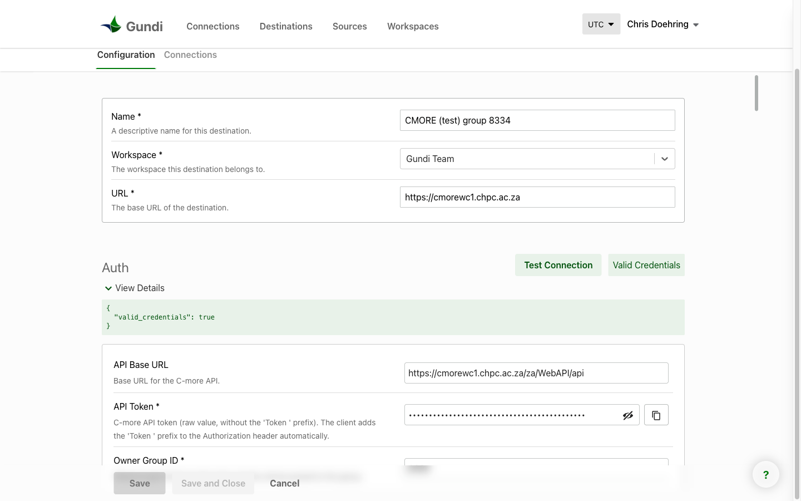

### 2.3 Map the event type to a CMORE tag

Without a mapping, events still arrive in CMORE — description, location, and
a link back to EarthRanger — but *unclassified*. The mapping is what fills in
the structured tag fields.

In **Deliver**, add an entry to **Event type → CMORE tag**:

1. **Gundi event_type**: `rhino_carcass` — the EarthRanger event type's
   internal name (ask your EarthRanger admin, or check the event type's
   value in the ER admin — it's the lowercase name with underscores, not the
   display name).
2. **CMORE Tag Name**: `Rhino Carcass` — exactly as the tag is spelled in
   CMORE's tag chooser.
3. **Field Mappings** — one row per detail you want carried over. Our test
   system maps six:

   | Gundi event_details key (from ER) | CMORE field name |
   |---|---|
   | `animal_sex` | `Animal Sex` |
   | `age_of_animal` | `Animal Age` |
   | `age_of_carcass` | `Carcass Age` |
   | `cause_of_death` | `Kill Type` |
   | `animal_id` | `Skull Tag Number` |
   | `animal_common_name` | `Rhino Spesies` |

   (Yes, "Rhino Spesies" — use CMORE's spelling exactly as it appears in the
   tag.)

   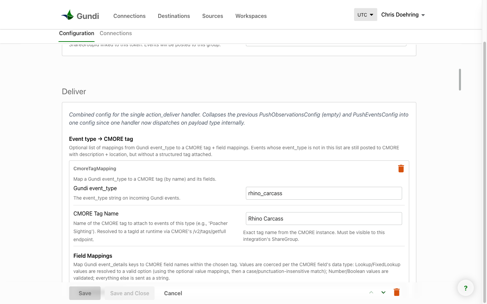

4. **Value Mappings** — only needed when EarthRanger's stored value and
   CMORE's option don't obviously match. Matching ignores case and
   punctuation, so ER `male` finds CMORE `Male` on its own. But EarthRanger's
   age classes don't look anything like CMORE's, so `Animal Age` gets
   explicit rows: `a_0-3_months` → `Calf`, `b_3_months1_year` → `Sub-Adult`,
   `d_2-3.5years` → `Adult`, and so on. Likewise `Black Rhino` → `Black` for
   the species field. Any value that can't be matched is dropped from the
   tag (and logged) rather than sent as garbage — unmapped values never
   break delivery, they just leave that one field empty.

   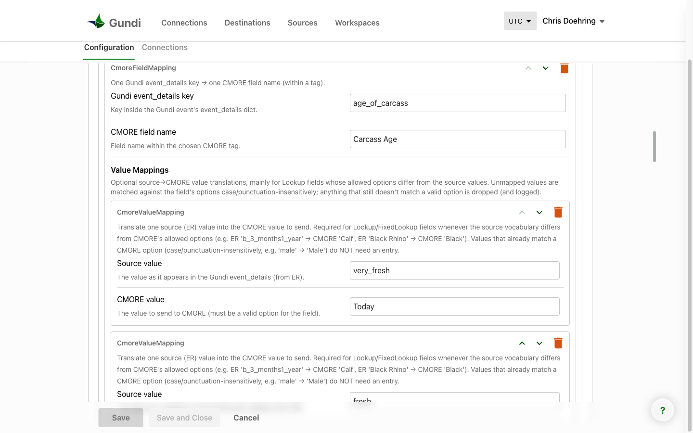

5. Save the configuration.

> **Shortcut for many fields:** authoring mappings by hand gets tedious for
> tag-heavy event types (CMORE's Rhino Carcass tag has 26 fields). Your
> integration engineer can generate a mapping automatically with the
> `scaffold-mapping` tool — see [Configuration](configuration.md#scaffolding-mappings).

## Part 3: Connect EarthRanger and choose what to share

The EarthRanger side of the connection controls *which* events leave
EarthRanger and *how often* Gundi checks for new ones.

1. On the connection page, open the **Provider** tab. It holds the
   EarthRanger side: the ER **Auth** token (with its own **Test Connection**
   button) and a **Pull Events** section. The credentials are usually set
   once, when the connection is first created.
2. In **Pull Events**, make sure **Event Types** includes `rhino_carcass` —
   or is left empty so all event types flow. This filter is the reason an
   event type can work in ER yet never reach CMORE.
3. Confirm the **Run On Schedule** toggle is on — that's what makes Gundi
   poll EarthRanger automatically (typically every few minutes; new events
   appear in CMORE after the next run).

   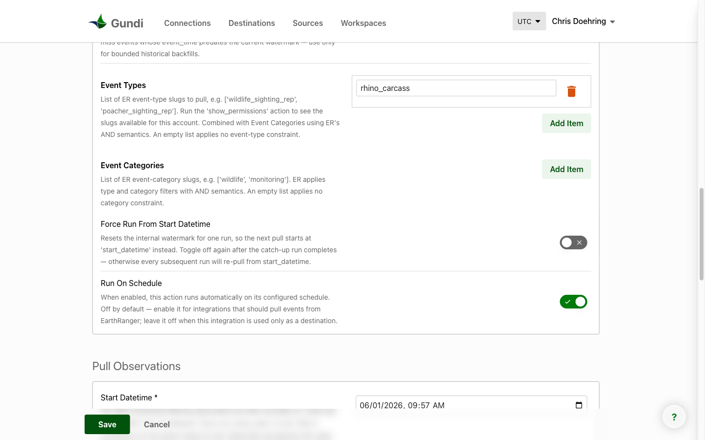

## Part 4: See it work

Time to prove the pipeline end-to-end.

1. In EarthRanger, open **Events** and click the **Create Event** button (or
   use the **+** button on the map). In the **Add Event** dialog, pick
   **Rhino Carcass** (under its category, e.g. *Monitoring*).
2. Fill in the fields you mapped in Part 2.3 — for the test at least
   **Animal Sex**, **Age of Animal**, and **Animal Common Name**, so you can
   see both an automatic match and a value mapping at work — plus notes that
   make it obviously a test, and save.

   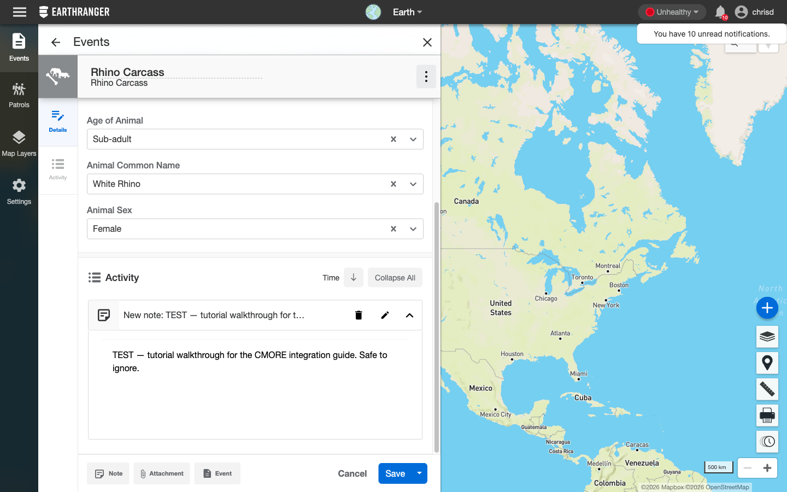

   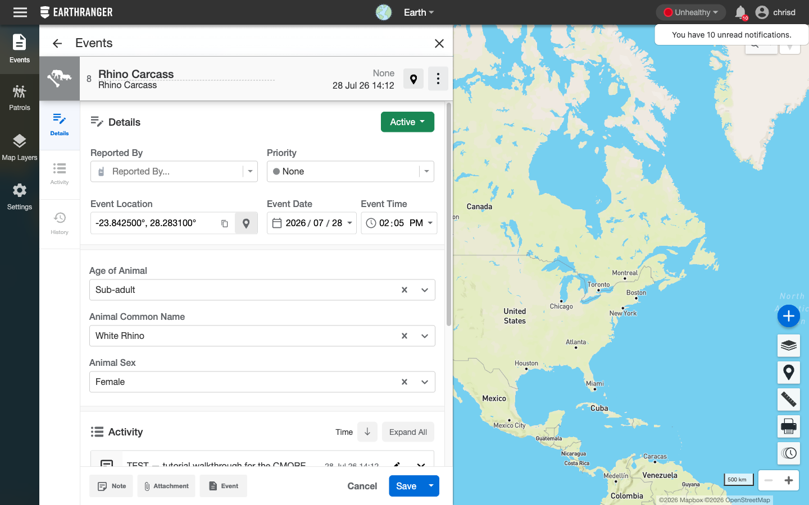

3. Wait one polling interval (Part 3, step 3), then open the CMORE Web
   Portal. Your event appears at the top of the message feed, titled with the
   event's EarthRanger title.
4. Click it. The Event Detail window shows:
   - the **description and location** from EarthRanger,
   - the **Rhino Carcass tag** with the mapped fields filled in,
   - a **comment with a link back to the EarthRanger event**, so anyone in
     CMORE can click through to the source, and
   - source **Generated**, meaning it was posted by the integration, not
     typed by a person.

   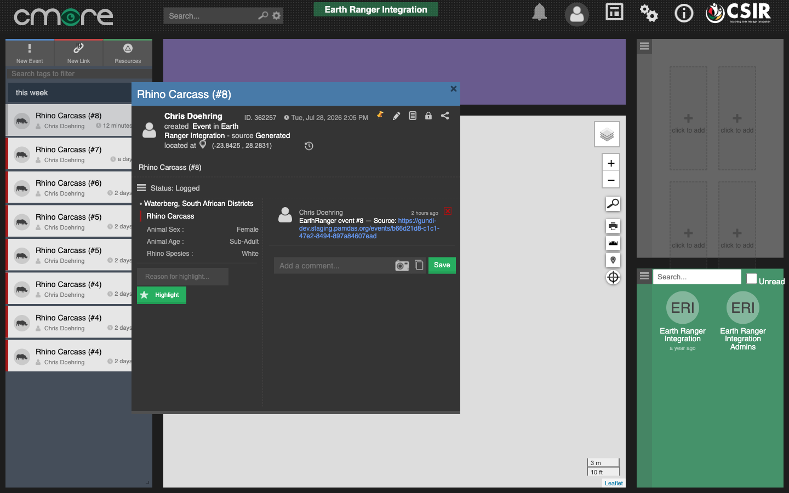

   In our test run, "White Rhino / Sub-adult / Female" from EarthRanger
   arrived as "White / Sub-Adult / Female" in CMORE — the value mappings and
   automatic matching from Part 2.3, working exactly as configured.

That's the whole loop. From here on, every `rhino_carcass` event your rangers
report is shared automatically. To share more event types, repeat Part 2.3
(one mapping entry per event type) — and check the tag's domain is granted
(Part 1.4).

## If something doesn't look right

| Symptom | Most likely cause | Where to look |
|---|---|---|
| Event arrives in CMORE but **without the tag** | Tag name misspelled in the mapping, or your share group can't see the tag's domain | [Events post, but the structured tag is missing](troubleshooting.md#events-post-but-the-structured-tag-is-missing) |
| Tag is there but **one field is empty** | That value needs a Value Mapping (Part 2.3, step 4) | [A specific lookup value is dropped](troubleshooting.md#a-specific-lookup-value-is-dropped) |
| **Nothing arrives** in CMORE at all | Event type not in the ER share filter, or routing/credentials problem | [Nothing reaches the runner at all](troubleshooting.md#nothing-reaches-the-runner-at-all) |
| **Test Connection fails** | Wrong token, wrong base URL (must end in `/za/WebAPI/api`), or service not Active / not linked to your group (Part 1.3) | re-run Part 1.2–1.3, then Test Connection again |
| **No link back to EarthRanger** on the event | Deep-link comment issue | [The source deep link doesn't appear in CMORE](troubleshooting.md#the-source-deep-link-doesnt-appear-in-cmore) |

For anything deeper, the Gundi portal's activity log on the connection shows
what was delivered, skipped, or errored — and the
[Troubleshooting](troubleshooting.md) page covers each case in detail.

[← Overview](index.md)
